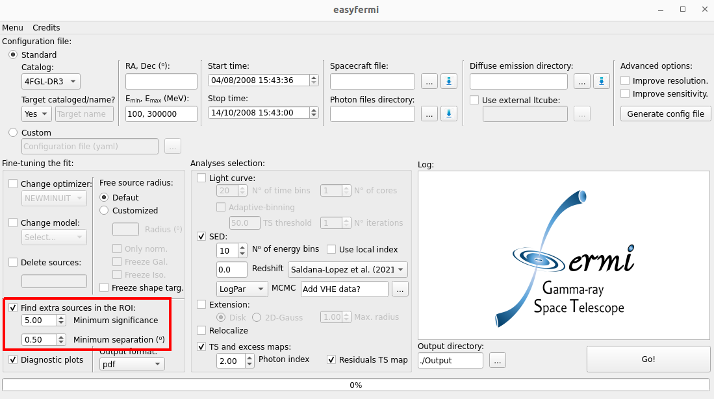
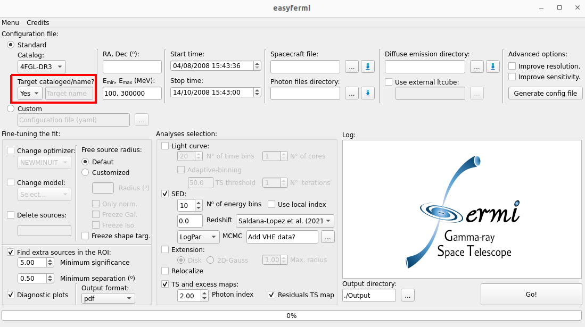
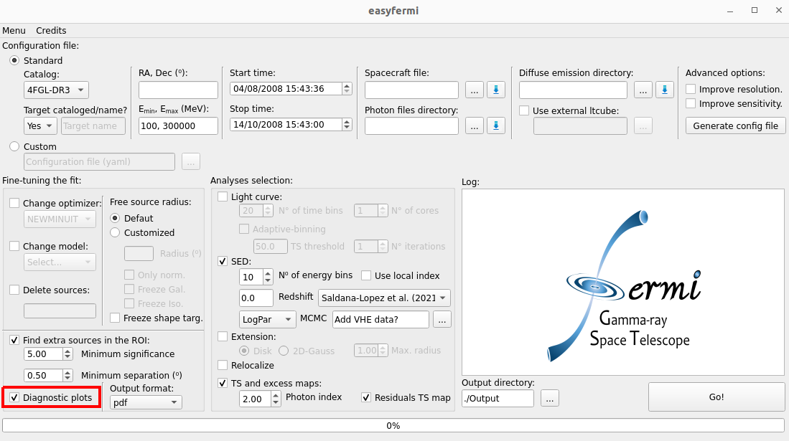
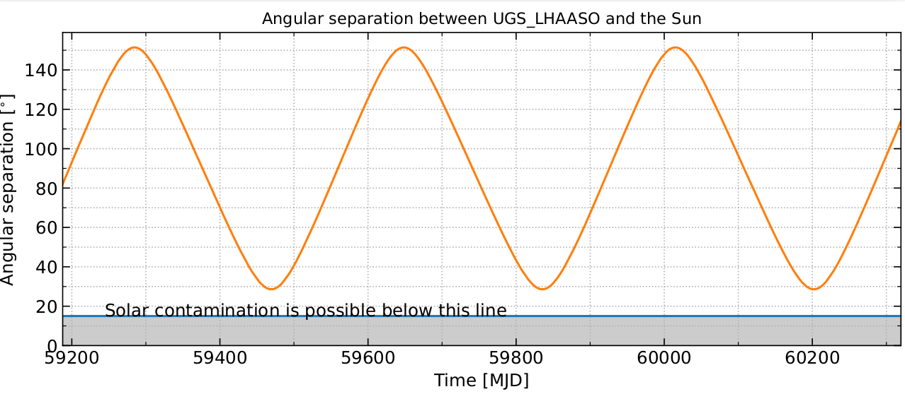

Basic Analysis
==============

  
.. _basic:

Binned likelihood analysis
--------------------------

The `binned likelihood analysis <https://fermi.gsfc.nasa.gov/ssc/data/analysis/scitools/binned_likelihood_tutorial.html>`_ performed in ``easyfermi`` starts by instantiating the ``fermipy`` class `GTAnalysis <https://fermipy.readthedocs.io/en/latest/quickstart.html#creating-an-analysis-script>`_ and feeding it with a configuration file (i.e. `'config.yaml'`) generated with the information given by the user in the graphical interface. The standard event classification and event type are set as ``evclass=128`` and ``evtype=3``, but these values can be changed by the user by checking the box **Improve resolution** or if the analysis is done in the **Custom** mode. 

The region of interest (RoI) width and zenith angle (:math:`z_{max}`) cut adopted in the **Standard** mode of ``easyfermi`` depend on the minimum energy set up in the graphical interface. In summary, if 

- :math:`E_{min} < 100` MeV, the RoI width is set to 17°, and :math:`z_{max} = 80°`.
- :math:`100 \leq E_{min} < 500` MeV, the RoI width is set to 15°, and :math:`z_{max} = 90°`.
- :math:`500 \leq E_{min} < 1000` MeV, the RoI width is set to 12°, and :math:`z_{max} = 100°`.
- :math:`E_{min} \geq 1000` MeV, the RoI width is set to 10°, and :math:`z_{max} = 105°`. 

For all these cases, we also include in the model all the cataloged sources lying in a region 10° larger than the width of the RoI (i.e. we set **src_roiwidth : roi_width + 10** in the configuration file). All these values can be changed by the user in the **Custom** mode of ``easyfermi``. Similarly, the data downloaded directly from the graphical interface contain photons within a region with radius :math:`14°~\mathrm{if}~E_{min} < 100` MeV, :math:`12°~\mathrm{if}~~100 \leq E_{min} < 500` MeV, :math:`11°~\mathrm{if}~~500 \leq E_{min} < 1000` MeV, and :math:`9°~\mathrm{if}~E_{min} \geq 1000` MeV. Furthermore, if the box **Improve sensitivity** is checked, the data will be split into 2 or 3 energy components (depending on :math:`E_{min}`) and :math:`z_{max}` will then assume the values shown above for each one of these components (if :math:`E_{min} < 500` MeV, the lowest energy component will have :math:`z_{max} = 90°` if :math:`E_{min} \geq 100` MeV, and :math:`z_{max} = 80°` otherwise).

The remaining **Standard** configuration of ``easyfermi`` is:

- edisp : True, for the energy dispersion.
- irfs : 'P8R3_SOURCE_V3', for the instrument response function.
- edisp_disable : ['isodiff'], to disable the energy dispersion correction in the isotropic component.
- edisp_bins : -2, to add two extra energy bins when accounting for energy dispersion.

All the intermediate analsyis files, such as ccube, ltcube, srcmaps, and exposure map are generated with the ``fermipy`` function ``setup()``. Once the setup is done, ``easyfermi`` computes a counts map (saved in the output directory as cmap.fits) by summing all the energy components of the ccube.fits file.

.. note::

   - For analyses in a time window larger than 1 year, the computation of the ltcube can take several hours to finish. In extreme situations, e.g. if you ara analyzing 14 years of data and check the box "improve sensitivity" on the graphical interface, the computation of the ltcube can take more than 20 hours.
   - If you want to analyze different targets **in the same time window and energy interval**, you don't need to compute the ltcube multiple times. You compute it once, and for the subsequent analyses you can simply import the ltcube list file (called "ltcube_list.txt" and saved in the output directory) under the checkbox "Use external ltcube".

The next step in the analysis is calling the ``fermipy`` function `optimize() <https://fermipy.readthedocs.io/en/0.6.8/fermipy.html#fermipy.gtanalysis.GTAnalysis.optimize>`_ with the following configuration:

.. code-block::
    
    optimize(npred_frac=0.95, npred_threshold=50, shape_ts_threshold=30)
    
This function optimizes the RoI model in three sequential steps:

 - Free the normalization of the N largest components (as determined from NPred) that contain a fraction *npred_frac* of the total predicted counts in the model and perform a simultaneous fit of the normalization parameters of these components.
 - Individually fit the normalizations of all sources that were not included in the first step in order of their *Npred* values. Skip any sources that have `NPred < npred_threshold`.
 - Individually fit the shape and normalization parameters of all sources with `TS > shape_ts_threshold` where TS is determined from the first two steps of the ROI optimization.

After the optimization, we give the option to the user to call the ``fermipy`` function `find_sources() <https://fermipy.readthedocs.io/en/v1.2/advanced/detection.html>`_ (by checking the box **Find extra sources in the ROI**, as shown in the figure below) with the following configuration:

.. code-block::
    
    find_sources(sqrt_ts_threshold=Minimum_significance, min_separation=Minimum_separation, multithread=True)
    
which will look for possible non-cataloged gamma-ray sources by generating a TS map for the RoI and identify peaks with :math:`\sqrt{TS} >` *Minimum_significance* and an angular separation of at least *Minimum_separation* from a higher amplitude peak in the TS map. This method can run several times until no sources with :math:`sqrt(TS) >` *Minimum_significance* are found. The values for *Minimum_significance* and *Minimum_separation* can be defined by the user in the graphical interface.

The standard fit in ``easyfermi`` is done with the ``fermipy`` function `fit() <https://fermipy.readthedocs.io/en/0.6.8/fermipy.html#fermipy.gtanalysis.GTAnalysis.fit>`_ with ``NewMinuit`` as the optimizer, although this can be changed by the user in the checkbox **Change optimizer**. The radius within which the parameters of all sources are free to vary (normalization and spectral shape) is set as half the RoI width (see the second paragraph of this section), but can be changed by the user in the panel **Free source radius**, under the **Customized** button. The adopted spectral model for the target will be that listed in the selected *Fermi*-LAT catalog (default is 4FGL-DR3) or a power law if the target is not listed in the selected catalog. This model can be changed at any time by the user under the box **Change model**, and the complete description of all available models can be found `here <https://fermi.gsfc.nasa.gov/ssc/data/analysis/scitools/source_models.html>`_. 

If the fit does not converge, ``easyfermi``:

 - deletes all sources with :math:`TS < TS_{cut}` from the RoI or...
 - deletes all sources with :math:`TS < TS_{target}` if :math:`TS_{target} < TS_{cut}`.
 - reruns the fit.

The default value for :math:`TS_{cut}` is 16, but the user can change this value in panel **Fine-tuning the fit** in the graphical interface.

If even after that the fit does not converge, the user can freely modify the parameters in the panel **Fine-tuning the fit** and rerun the analysis.

.. note::

   The :math:`TS_{target}` threshold was fixed at 25 until ``easyfermi 2.0.7``. 

Once the RoI fit is done, the results are saved in the output directory in the file *Target_results.txt* (for a quick look at the target parameters) and in the file *Results.fits* (for all sources in the RoI).

  
Non-cataloged target
--------------------

If your target is not listed in the adopted *Fermi*-LAT catalog, you have to set the combo box **Target cataloged/name** to **No** (see figure below) and give a nickname to your target. It can be any name you want. This target will be added as a point-source with a power-law spectrum, but you can change this spectral model under the box **Change model**.

Diagnostic plots
----------------

If the box **Diagnostic plots** is checked (see figure below), all of the diagnostic plots created by ``fermipy`` are saved in the output directory, such as the model map, the excess map, the y and x counts profile, etc.

  
The novelty diagnostic plot of ``easyfermi`` is the angular separation between the target and the Sun within the given time window. We compute this separation based on the data available in the *Fermi*-LAT spacecraft file and using the ``astropy`` class `SkyCoord() <https://docs.astropy.org/en/stable/api/astropy.coordinates.SkyCoord.html>`_. This plot is useful, e.g., to look for possible solar contamination on your SED or light curve. In the figure below, we show the diagnostic plot for the angular separation between the target 1LHAASO J1219+2915 and the Sun over the period of ~3 years. 

