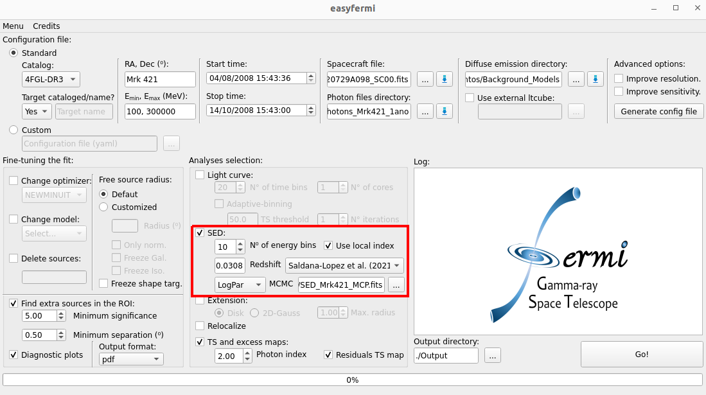
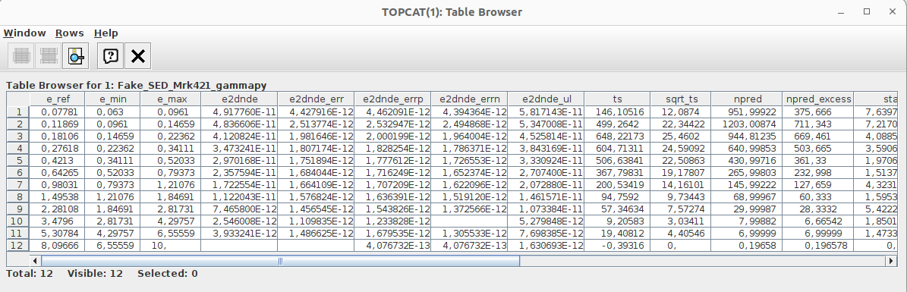

Spectral energy distribution (SED)
==================================

.. _Standar SED:

Standard SED
------------

The standard SED generated with **easyfermi** uses the ``fermipy`` function `sed() <https://fermipy.readthedocs.io/en/latest/advanced/sed.html>`_ with the following configuration:

.. code-block::
    
    sed(Target_Name,loge_bins=N_energy_bins,make_plots=False,use_local_index=use_local_index,write_npy=False)

Where the input parameters are:

* **Target_Name**: This is the name of the target as listed in the adopted Fermi-LAT catalog or the target name written in the field "Target name" in the graphical interface.

* **N_energy_bins**: The number of energy bins set up in the graphical interface as "**N° of energy bins**".

* **use_local_index**: If the box **Use local index** is checked in the graphical interface, we use a power-law approximation to the shape of the global spectrum in each bin. If not checked, then a constant index, :math:`\gamma = 2`,  will be adopted for all energy bins.

The parameters **make_plots** and **write_npy** are always set as **False** in **easyfermi**. For more details on them, see the `fermipy sed documentation <https://fermipy.readthedocs.io/en/latest/advanced/sed.html>`_.

Extragalactic background light (EBL) absorption correction
----------------------------------------------------------

This method corrects the EBL absorption observed in the highest energy bins in the SEDs of extragalactic targets using the ``gammapy`` class `EBLAbsorptionNormSpectralModel <https://docs.gammapy.org/dev/api/gammapy.modeling.models.EBLAbsorptionNormSpectralModel.html>`_. This correction will be applied to any analysis as long as the box **Redshift** has a value above zero. The user can then select which EBL absorption model to use, where the options are:

 - `Franceschini et al. 2008 <http://adsabs.harvard.edu/abs/2008A%26A...487..837F>`_.
 - `Finke et al. 2010 <http://adsabs.harvard.edu/abs/2009arXiv0905.1115F>`_.
 - `Dominguez et al. 2011 <http://adsabs.harvard.edu/cgi-bin/bib_query?arXiv:1007.1459>`_.
 - `Franceschini & Rodighiero 2017 <https://ui.adsabs.harvard.edu/abs/2017A%26A...603A..34F/abstract>`_.
 - `Saldana-Lopez et al. 2021 <https://ui.adsabs.harvard.edu/abs/2021MNRAS.507.5144S/abstract>`_.

If this correction is applied, the MCMC estimation (see Section `MCMC`_) of parameters will be performed in the corrected SED.

.. _MCMC:

Markov Chain Monte Carlo (MCMC)
-------------------------------

The estimation of parameters with MCMC in ``easyfermi`` is done with `emcee <https://emcee.readthedocs.io/en/stable/>`_ and it requires a minimum number of 3 data points with :math:`TS > 9`. The likelihood function that we maximize in ``easyfermi`` is given by:

:math:`\mathcal{L} = - \frac{1}{2}\sum_n\left[ \frac{(y_n - f(\vec\theta,x_n))^2}{\sigma_n^2} \right]`

where the sum is performed over all data points with :math:`TS > 9`, :math:`y_n` and :math:`x_n` are the y (differential flux) and x (energy) values for each data point, :math:`\sigma_n` is the error associated with the :math:`y` component of each data point, and :math:`f(\vec\theta,x_n)` is the adopted specral model feeded with a set of parameters :math:`\vec\theta`. 

The spectral models available for the MCMC are:

 - **PowerLaw**: :math:`\frac{dN}{dE} = N_0\left(\frac{E}{E_0} \right)^{-\alpha}`, i.e the classical power-law function, where :math:`\frac{dN}{dE}` is in units of :math:`\mathrm{cm}^{-2}\mathrm{s}^{-1}`, :math:`E` is in MeV, and the priors are -15 < :math:`\log(N_0)` < -8 and 0.5 < :math:`\alpha` < 5.0.

 - **LogPar**: :math:`\frac{dN}{dE} = N_0\left(\frac{E}{E_0} \right)^{-\alpha -\beta\log(E/E_0)}`, i.e. the classical log-parabola function, where :math:`\frac{dN}{dE}` is in units of :math:`\mathrm{cm}^{-2}\mathrm{s}^{-1}`, :math:`E` is in MeV, and the priors are set to -15 < :math:`\log(N_0)` < -8, 1.0 < :math:`\alpha` < 4.0, and -1 < :math:`\beta` < 1.0.

 - **LogPar2**: :math:`S(E) = S_p10^{-\alpha\log^2_{10}(E/E_p)}`, which is another parametrization of the log-parabola, conveniently giving us the differential energy flux at the log-parabola peak, :math:`S(E)` [MeV :math:`\mathrm{cm}^{-2}\mathrm{s}^{-1}`], the value of the energy peak, :math:`E_p` [MeV], and the spectral curvature :math:`\alpha`. The priors are set to -7 < :math:`\log(S_p)` < -2, -1.0 < :math:`\alpha` < 1.0, and 2 < :math:`E_p` < 7.

 - **PLEC**: :math:`\frac{dN}{dE} = N_0\left(\frac{E}{E_0} \right)^{-\alpha} e^{-(E/E_0)^b}`, i.e. a power-law with a super exponential cutoff, where :math:`\frac{dN}{dE}` is in units of :math:`\mathrm{cm}^{-2}\mathrm{s}^{-1}` and :math:`E` is in MeV. The priors are set to -15 < :math:`\log(N_0)` < -8, 1.0 < :math:`\alpha` < 4.0, 3.0 < :math:`E_c` < 7.0, and 0.2 < :math:`b` < 3.0.
 
 - **PLEC_bfix**: same as above, but with :math:`b \equiv 1`.

Finally, we adopt 300 walkers, iterate them 500 times, and fix :math:`E_0 \equiv 2 E_{min}`, where :math:`E_{min}` is read from the graphical interface or from the customized configuration file.

.. note::

   The upper limits (i.e. any energy bin with TS < 9) are not included in the MCMC parameter estimation.

VHE table format
----------------

The format of the VHE data table is a standard SED table produced with ``gammapy`` 1.1.

It will work with any **.fits** table, as long as this table contains the following columns in the first extension HDU (e.g. hdul[1].data):

- **e_ref**, **e_min**, and **e_max**, all in TeV
- **e2dnde**, **e2dnde_err**, **e2dnde_ul**, all in TeV cm-2 s-1
- **ts**

In the figure below we show you how this table should look like (this is actually **fake** data for Mrk 421).

  
  
Model selection with the Akaike information criterion 
-----------------------------------------------------

As a tool for model selection, ``easyfermi`` provides the `Akaike information criterion (AIC) <https://en.wikipedia.org/wiki/Akaike_information_criterion>`_. The AIC is printed in the ``easyfermi`` log and saved in the files *Target_results.txt* and *TARGET_NAME_sed.fits*.

We use a slightly modified form of this method defined as:

:math:`AIC = 2k + 2ln(-\mathcal{L}_{max})`,

where *k* is the number of free parameters in the given model, and :math:`\mathcal{L}_{max}` is the maximized likelihood function defined above.

Given a set of candidate models for the data, the preferred model is the one with the minimum AIC value. For the same dataset, two spectral models can be compared by the following expression:

:math:`e^{(AIC_{min} − AIC_{test})/2}`.

For instance, let's suppose that you have the spectral data for Mrk 421 and you try to fit this data with a power law (PL) and then with a log-parabola (LP). Let's also suppose that :math:`AIC_{PL} = 6.1` and :math:`AIC_{LP} = 7.5`. Since the minimum AIC is achieved for the PL model, this means that the LP model is

:math:`e^{(6.1 − 8.5)/2} = 0.301` times as probable as the power-law model to minimize the information loss.

