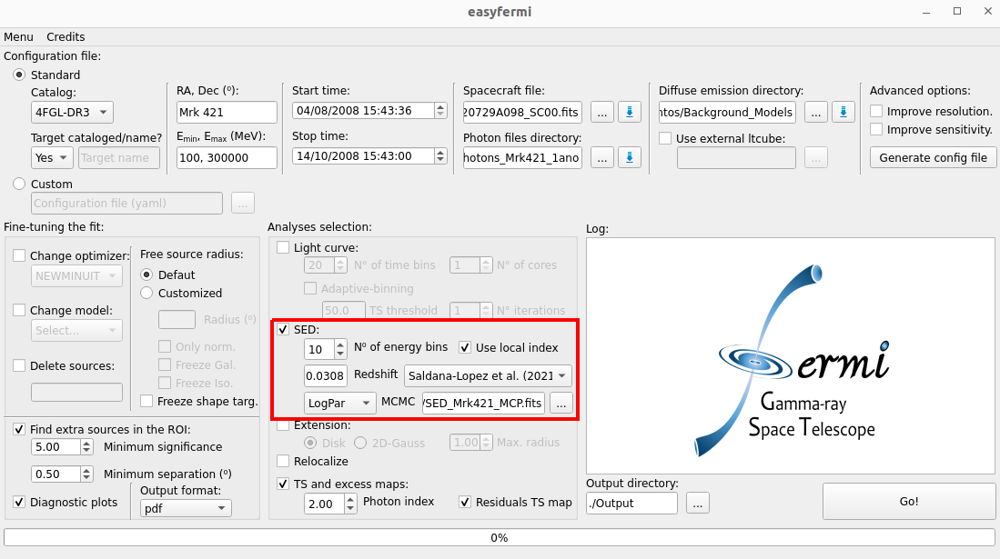
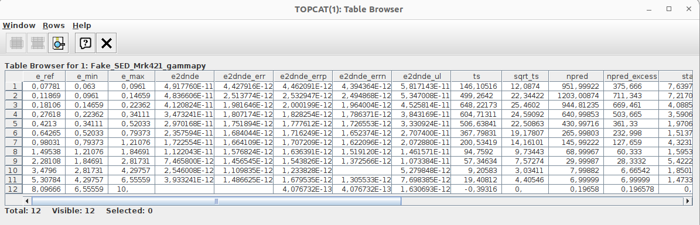
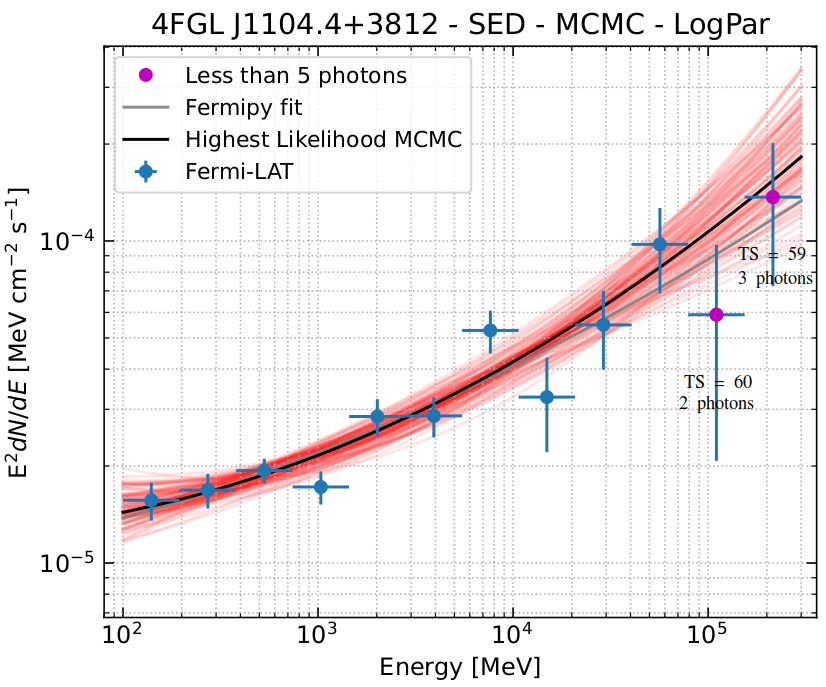

Spectral energy distribution (SED)
==================================

.. _Standar SED:

Standard SED
------------

The standard SED generated with **easyfermi** uses the ``fermipy`` function `sed() <https://fermipy.readthedocs.io/en/latest/advanced/sed.html>`_ with the following configuration:

.. code-block::
    
    sed(Target_Name,loge_bins=N_energy_bins,make_plots=False,use_local_index=use_local_index,write_npy=False)

Where the input parameters are:

* **Target_Name**: This is the name of the target as listed in the adopted Fermi-LAT catalog or the target name written in the field "Target name" in the graphical interface.

* **N_energy_bins**: The number of energy bins set up in the graphical interface as "**N° of energy bins**".

* **use_local_index**: If the box **Use local index** is checked in the graphical interface, we use a power-law approximation to the shape of the global spectrum in each bin. If not checked, then a constant index, :math:`\gamma = 2`,  will be adopted for all energy bins.

The parameters **make_plots** and **write_npy** are always set as **False** in **easyfermi**. For more details on them, see the `fermipy sed documentation <https://fermipy.readthedocs.io/en/latest/advanced/sed.html>`_.

Extragalactic background light (EBL) absorption correction
----------------------------------------------------------

This method corrects the EBL absorption observed in the highest energy bins in the SEDs of extragalactic targets using the ``gammapy`` class `EBLAbsorptionNormSpectralModel <https://docs.gammapy.org/dev/api/gammapy.modeling.models.EBLAbsorptionNormSpectralModel.html>`_. This correction will be applied to any analysis as long as the box **Redshift** has a value above zero. The user can then select which EBL absorption model to use, where the options are:

 - `Franceschini et al. 2008 <http://adsabs.harvard.edu/abs/2008A%26A...487..837F>`_.
 - `Finke et al. 2010 <http://adsabs.harvard.edu/abs/2009arXiv0905.1115F>`_.
 - `Dominguez et al. 2011 <http://adsabs.harvard.edu/cgi-bin/bib_query?arXiv:1007.1459>`_.
 - `Franceschini & Rodighiero 2017 <https://ui.adsabs.harvard.edu/abs/2017A%26A...603A..34F/abstract>`_.
 - `Saldana-Lopez et al. 2021 <https://ui.adsabs.harvard.edu/abs/2021MNRAS.507.5144S/abstract>`_.
 - `Finke et al. 2022, model A <https://ui.adsabs.harvard.edu/abs/2022ApJ...941...33F/abstract>`_.

If this correction is applied, the MCMC estimation (see Section `MCMC`_) of parameters will be performed in the corrected SED.

.. _MCMC:

Markov Chain Monte Carlo (MCMC)
-------------------------------

The estimation of parameters with MCMC in ``easyfermi`` is done with `emcee <https://emcee.readthedocs.io/en/stable/>`_ and it requires a minimum number of 3 data points with :math:`TS > 9`. The log-likelihood function that we maximize in ``easyfermi`` is given by:

:math:`ln\mathcal{L} = ln\mathcal{L}_{points} + ln\mathcal{L}_{UL}`

where the first term accounts for the data points (energy bins with :math:`TS > 9`) and the second one for the upper limits (energy bins with :math:`TS \leq 9`). The data points are fitted in logarithmic scale:

:math:`ln\mathcal{L}_{points} = - \frac{1}{2}\sum_n\left[ \frac{(\log_{10} y_n - \log_{10} f(\vec\theta,x_n))^2}{\sigma_n^2} \right]`

where the sum is performed over all data points with :math:`TS > 9`, :math:`y_n` and :math:`x_n` are the y (differential flux) and x (energy) values for each data point, :math:`\sigma_n = \sigma_{y_n}/(y_n \ln 10)` is the error associated with the :math:`y` component of each data point propagated to logarithmic scale, and :math:`f(\vec\theta,x_n)` is the adopted specral model feeded with a set of parameters :math:`\vec\theta`.

The upper limits are included in the likelihood with one term per energy bin, where :math:`S(E,\vec\theta)` is the differential energy flux (:math:`E^2 dN/dE`) predicted by the model:

* If the best-fit flux, :math:`F_k`, and its error, :math:`\sigma_k`, are available for the energy bin (as for all the Fermi-LAT bins), we use a Gaussian term in linear scale: :math:`ln\mathcal{L}_{UL,k} = - \frac{1}{2}\left[ \frac{S(E_k,\vec\theta) - F_k}{\sigma_k} \right]^2`. This penalizes models that predict a flux above the best-fit flux of the bin, but only weakly penalizes models below it, since this flux is compatible with zero.

* If only the upper limit, :math:`UL_k`, is known (as for the upper limits of the VHE table), we use a censored Gaussian term: :math:`ln\mathcal{L}_{UL,k} = \ln\Phi\left[ \frac{UL_k - S(E_k,\vec\theta)}{\sigma_k} \right]`, where :math:`\Phi` is the cumulative distribution function of the standard normal distribution and :math:`\sigma_k = UL_k/1.645`, i.e. we assume that the 95% upper limit comes from a measurement compatible with zero flux.

If the EBL absorption correction is applied, the data points and the upper limits are corrected before the fit.

The spectral models available for the MCMC are:

 - **PowerLaw**: :math:`\frac{dN}{dE} = N_0\left(\frac{E}{E_0} \right)^{-\alpha}`, i.e the classical power-law function, where :math:`\frac{dN}{dE}` is in units of :math:`\mathrm{cm}^{-2}\mathrm{s}^{-1}\mathrm{MeV}^{-1}`, :math:`E` is in MeV, and the priors are -15 < :math:`\log_{10}(N_0)` < -7 and 0.5 < :math:`\alpha` < 5.0.

 - **LogPar**: :math:`\frac{dN}{dE} = N_0\left(\frac{E}{E_0} \right)^{-\alpha -\beta\log(E/E_0)}`, i.e. the classical log-parabola function, where :math:`\frac{dN}{dE}` is in units of :math:`\mathrm{cm}^{-2}\mathrm{s}^{-1}\mathrm{MeV}^{-1}`, :math:`E` is in MeV, and the priors are set to -15 < :math:`\log_{10}(N_0)` < -7, 1.0 < :math:`\alpha` < 4.0, and -1 < :math:`\beta` < 1.0.

 - **LogPar_MTT**: :math:`S(E) = S_p10^{-\alpha\log^2_{10}(E/E_p)}`, which is another parametrization of the log-parabola, conveniently giving us the differential energy flux at the log-parabola peak, :math:`S_p` [MeV :math:`\mathrm{cm}^{-2}\mathrm{s}^{-1}`], the position of this peak in the energy axis, :math:`E_p` [MeV], and the spectral curvature :math:`\alpha`. The priors are set to -7 < :math:`\log_{10}(S_p)` < -1, -1.0 < :math:`\alpha` < 1.0, and 2 < :math:`\log_{10}(E_p)` < 7. The suffix "MTT" stands for Massaro et al. (2004), Tanihata et al. (2004), and Tramacere et al. (2007), which are the first works reporting this parametrization of the log-parabola curve.

 - **PLEC**: :math:`\frac{dN}{dE} = N_0\left(\frac{E}{E_0} \right)^{-\alpha} e^{-(E/E_c)^b}`, i.e. a power-law with a super exponential cutoff, where :math:`\frac{dN}{dE}` is in units of :math:`\mathrm{cm}^{-2}\mathrm{s}^{-1}\mathrm{MeV}^{-1}` and :math:`E` is in MeV. The priors are set to -15 < :math:`\log_{10}(N_0)` < -7, 1.0 < :math:`\alpha` < 4.0, 3.0 < :math:`\log_{10}(E_c)` < 7.0, and 0.2 < :math:`b` < 3.0.
 
 - **PLEC_bfix**: same as above, but with :math:`b \equiv 1`.
 
 - **PLEC_deMenezes**: :math:`S(E) = S_p\left(\frac{E_p}{E} \right)^{\alpha-2} e^{((2-\alpha)/b)(1-(E/E_p)^b)}`, which is a parametrization of the PLEC developed for ``easyfermi`` conveniently giving us the differential energy flux at the PLEC peak, :math:`S_p` [MeV :math:`\mathrm{cm}^{-2}\mathrm{s}^{-1}`], the position of this peak in the energy axis, :math:`E_p` [MeV], the power law spectral index :math:`\alpha`, and the super-exponential index :math:`b`. With this model one can directly estimate :math:`S_p`, :math:`E_p`, and their corresponding errors without recurring to huge error propagation formulas. If you use this parametrization in another context, please cite the ``easyfermi`` paper `de Menezes (2022) <https://ui.adsabs.harvard.edu/abs/2022A%26C....4000609D/abstract>`_ and this documentation. The priors are set to -8 < :math:`\log_{10}(S_p)` < -1, 0 < :math:`\alpha` < 4.0, 2.0 < :math:`\log_{10}(E_p)` < 7.0, and 0.01 < :math:`b` < 3.0.

All the priors are uniform, and we fix :math:`E_0 \equiv E_{min}`, where :math:`E_{min}` is read from the graphical interface or from the customized configuration file.

The number of walkers and steps is not fixed, since the MCMC runs until the chains converge:

1. We first find the maximum-likelihood point, with a random search over the priors followed by a Nelder-Mead optimization, and initialize 50 walkers (or :math:`2N_{par}+2` walkers, if this number is larger) in a small region around this point.

2. The walkers run in blocks of 500 steps. After each block, we estimate the integrated autocorrelation time, :math:`\tau`, of every parameter. The MCMC stops when the chain is longer than :math:`50\tau` and :math:`\tau` changed by less than 1% since the previous block (the criterion suggested in the `emcee documentation <https://emcee.readthedocs.io/en/stable/tutorials/autocorr/>`_), or when it reaches 30000 steps.

3. The first :math:`5\tau` steps of the chains are discarded as burn-in, and the remaining ones are thinned by :math:`\tau/2`, such that the posterior samples are nearly independent.

The best-fit value of each parameter is the median of its posterior distribution (50th percentile), and the uncertainties are given by the 16th and 84th percentiles. The MCMC diagnostics (number of walkers and steps, burn-in, thinning, :math:`\tau`, acceptance fraction, and whether the convergence criterion was reached) are printed in the ``easyfermi`` log, written in *Target_results.txt*, and saved in the header of the table "MCMC Parameters" in *TARGET_NAME_sed.fits*. If the MCMC stops at 30000 steps with a chain shorter than :math:`20\tau`, ``easyfermi`` warns that the posterior distribution is not reliable.

VHE table format
----------------

The format of the VHE data table is a standard SED table produced with ``gammapy`` 1.1.

It will work with any **.fits** table, as long as this table contains the following columns in the first extension HDU (e.g. hdul[1].data):

- **e_ref**, **e_min**, and **e_max**, all in TeV
- **e2dnde**, **e2dnde_err**, **e2dnde_ul**, all in TeV cm-2 s-1
- **ts**

In the figure below we show you how this table should look like (this is actually **fake** data for Mrk 421).

  
  
Model selection with the Akaike information criterion 
-----------------------------------------------------

As a tool for model selection, ``easyfermi`` provides the `Akaike information criterion (AIC) <https://en.wikipedia.org/wiki/Akaike_information_criterion>`_. The AIC is printed in the ``easyfermi`` log and saved in the files *Target_results.txt* and *TARGET_NAME_sed.fits*.

We use a slightly modified form of this method defined as:

:math:`AIC = 2k - 2ln\mathcal{L}_{max}`,

where *k* is the number of free parameters in the given model, and :math:`\mathcal{L}_{max}` is the maximized likelihood function defined above.

Given a set of candidate models for the data, the preferred model is the one with the minimum AIC value. For the same dataset, two spectral models can be compared by the following expression:

:math:`e^{(AIC_{min} − AIC_{test})/2}`.

For instance, let's suppose that you have the spectral data for Mrk 421 and you try to fit this data with a power law (PL) and then with a log-parabola (LP). Let's also suppose that :math:`AIC_{PL} = 6.1` and :math:`AIC_{LP} = 8.5`. Since the minimum AIC is achieved for the PL model, this means that the LP model is

:math:`e^{(6.1 − 8.5)/2} = 0.301` times as probable as the power-law model to minimize the information loss.

Data points with less than 5 photons
------------------------------------

The likelihood ratio method adopted in the fermitools, fermipy and easyfermi attributes higher significance to higher energy photons, such that a couple of photons with energies > 100 GeV can easily reach TS > 25. For source detection, this is perfectly fine, since the background at these energies is relatively low and the photon/hadron separation and direction reconstructed by LAT are much better than at low energies (e.g. below 1 GeV). This means that if you detect 2 photons with more than 100 GeV coming from the same position in the sky, it is indeed very likely that there is a gamma-ray source there.

There is, however, a subtle but important difference between being able to detect a source and being able to measure its flux. When trying to build an SED, for instance, the highest-energy bins may have only a few photons and still give you relatively high TSs. In the figure below, we show the spectrum of Mrk 421 observed over 2 months. We see that the highest-energy bins have TSs ~ 60, although we have only 2 or 3 photons for each bin. The differential flux measurements with such a low number of photons is prone to strong fluctuations that can possibly affect the modeling of the SED. Furthermore, we cannot trust statistical error bars if the measurement is not done in a statistically valid sample (i.e. a large number of counts).

In easyfermi, we warn the users about this issue by checking how many photons within a radius of 0.5° from the RoI center are detected for all the SED bins with energies > 10 GeV. If a specific bin has less than 5 photons, it will apear as a magenta point in the SED quickplot. These warnings are saved in the column "Warning_few_photons" in the TARGET_NAME_sed.fits file and can help the users in the task of selecting or not these data points when trying to fit a model.

.. _SED per LC bin:

SEDs for the light-curve bins
-----------------------------

If the box **Compute SEDs for LC bins** is checked, ``easyfermi`` computes the SED of the target in every time bin of a light curve, and then applies the MCMC (see Section `MCMC`_) to each one of them. This allows us to follow the evolution of the spectral parameters (e.g. :math:`S_p` and :math:`E_p`) along the light curve.

The light curve is chosen automatically, with the following priority:

1. The latest modified Bayesian-blocks light curve (see :ref:`Bayesian blocks`).
2. The latest modified adaptive-binning light curve.
3. The latest modified constant-binning light curve.

The light-curve directory must contain the **lightcurve_XXX** directories with the analysis of each time bin, which are created by ``fermipy`` when the light curve is computed.

**SED of each time bin**

For each time bin, ``easyfermi`` reloads the analysis of that bin (using its *config.yaml* file), frees the normalizations of all the sources within 3° of the RoI center, the Galactic and isotropic diffuse components, and the target, and refits the model. Then it computes the SED with the same configuration used for the standard SED (see :ref:`Standar SED`), i.e. with the same energy range, the same number of energy bins and the same option **Use local index**:

.. code-block::

    sed(Target_Name,loge_bins=loge_bins,make_plots=False,use_local_index=use_local_index,write_fits=True,write_npy=False)

The time bins are processed in parallel, with one process per bin and a total of (number of CPUs - 1) processes, only for Linux OS. For Mac OS the SEDs are computed one by one. If a time bin already has a *sed.fits* file, its SED is not recomputed.

**MCMC of each time bin**

The MCMC is applied to the SED of each time bin with the same spectral model, EBL absorption correction and redshift selected for the SED of the full time interval, and with the same likelihood, priors and convergence criteria described in Section `MCMC`_. Time bins with less than 3 data points with :math:`TS > 9` are skipped.

**Output files**

* In each **lightcurve_XXX** directory: the file *TARGET_NAME_sed.fits*, containing the SED, the tables "MCMC Parameters" and "MCMC Posterior dist." (and the EBL-corrected columns, if the redshift is above zero), and the figure *Quickplot_SED_MCMC.png*.

* In the light-curve directory: the file *MCMC_per_bin_summary_MODEL.ecsv* (where MODEL is the spectral model of the MCMC), a table with one row per time bin containing the time interval (**tmin_mjd** and **tmax_mjd**), the number of data points and upper limits, the best-fit parameters with their lower and upper uncertainties, the AIC, the MCMC convergence information, and the status of the analysis of the bin (done, skipped or failed).

* In the directory **SEDs_for_all_LC_bins**, inside the light-curve directory: copies of the SED files and quick plots of all the time bins, renamed to include the time interval of the bin in MET (seconds), i.e. *TARGET_NAME_TMIN_TMAX_sed.fits* and *Quickplot_SED_MCMC_TMIN_TMAX.png*.

