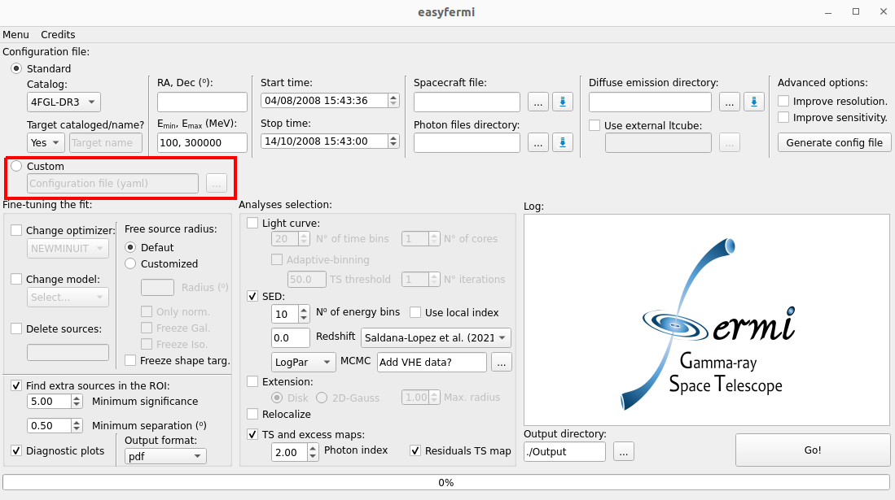

Custom analysis
===============

.. role::  raw-html(raw)
    :format: html

.. _Custom:

Here we give you some examples on how to customize your analysis with ``easyfermi``. In summary, you simply have to modify a configuration file and upload it in the ``easyfermi`` window as indicated in the figure above.

If you don't know where to start with your own configuration file, you can add the coordinates (or name), desired energy and time ranges, and the paths to the data files under the "Standard" button in the ``easyfermi`` main window and then click in the button "Generate config file". This action will generate a 'config.yaml' file within the output directory, allowing you full flexibility to customize it according to your preferences.

.. note::

   If you check the boxes "Improve resolution" and/or "Improve sensitivity", the config.yaml file generated with the button "Generate config file" will be modified accordingly.

Below we give you some examples of customized configuration files.

Precise selection of time intervals 
-----------------------------------

`Tutorial available on YouTube <https://www.youtube.com/watch?v=BG3ldxJv7t4&ab_channel=easyFermi>`_.

Let's suppose you want to build the average SED for 3 specific time windows for BL Lac. In this case, the only feature you need to add to the "config.yaml" file is the line "filter", as indicated in the highlighted line below.

.. code-block::
    :emphasize-lines: 20
    
    data:
      evfile : /home/user/Documentos/GUI/Tutorials/BLLac/Output/list.txt
      scfile : /home/user/Documentos/spacecraft/L240206050150320729A098_SC00.fits

    binning:
      roiwidth   : 15
      binsz      : 0.1
      binsperdec : 8

    selection :
      emin : 100.0
      emax : 300000.0
      zmax    : 90
      evclass : 128
      evtype  : 3
      ra: 330.68038041666665
      dec: 42.277771944444446
      tmin: 638496005
      tmax: 655776005
      filter: '((START>6.40997722E8) && (STOP<6.41582362E8)) || ((START>6.4909916E8) && (STOP<6.4943324E8))  || ((START>6.4943324E8) && (STOP<6.4976732E8))'

    gtlike:
      edisp : True
      irfs : 'P8R3_SOURCE_V3'
      edisp_disable : ['isodiff']
      edisp_bins : -2

    model:
      src_roiwidth : 25
      galdiff  : '/home/user/Documentos/Background_Models/gll_iem_v07.fits'
      isodiff  : '/home/user/Documentos/Background_Models/iso_P8R3_SOURCE_V3_v1.txt'
      catalogs : ['4FGL-DR3']

Customized resolution and better SED on the Galactic plane
----------------------------------------------------------

At the cost of decreasing the sensitivity, you can cut the photons with worst positional reconstruction from your dataset by selecting only the photons lying within the best PSF quartiles (`details here <https://fermi.gsfc.nasa.gov/ssc/data/analysis/documentation/Cicerone/Cicerone_Data/LAT_DP.html>`_.)

Below we give the example of a config.yaml file generated with the button "Generate config file" for Mrk 501, and then we discuss how you can modify it to analyze the data that better suits your goals.

This config.yaml file was generated with the boxes "Improve resolution" and "Improve sensitivity" checked. Checking the box "Improve sensitivity" for such a large energy range (i.e. from 100 MeV up to 800 GeV), means that we will perform the Fermi-LAT analysis for three different energy components, tuned to improve sensitivity at the highest energies (see :doc:`Basic_analysis`). 

.. note::

   Even if you are not interested in a better resolution, you can use this method to improve the quality of your low energy (i.e. < 500 MeV) SED data points. For instance, if your target is in the Galactic plane, where the contamination levels are very high at low energies, a standard analysis eventually gives you an SED where the lowest energy data points seem too high to be true (e.g. more than :math:`3\sigma` away from the fitted model). This happens because several badly reconstructed photons that do not belong to your target are being swallowed into your analysis. So if you are analyzing a strong source in the Galactic plane, it is typically a good idea to remove the low-energy photons with the worst reconstruction (i.e. PSF0) from your analysis.

.. code-block::

    data:
      evfile : /home/user/Documentos/GUI/easyFermi/code/LHAASO_counterparts/Output_Mrk501/list.txt
      scfile : /home/user/Documentos/GUI/easyFermi/code/LHAASO_counterparts/spacecraft/L240204110942320729A088_SC00.fits

    binning:
      roiwidth   : 15
      binsz      : 0.1
      binsperdec : 8

    selection :
      emin : 100.0
      emax : 800000.0
      zmax    : 90
      evclass : 128
      evtype  : 48
      ra: 253.46756916666664
      dec: 39.76016888888889
      tmin: 636249601
      tmax: 686275200

    gtlike:
      edisp : True
      irfs : 'P8R3_SOURCE_V3'
      edisp_disable : ['isodiff']
      edisp_bins : -2

    model:
      src_roiwidth : 25
      galdiff  : '/home/user/Documentos/Background_Models/gll_iem_v07.fits'
      isodiff  : '/home/user/Documentos/Background_Models/iso_P8R3_SOURCE_V3_v1.txt'
      catalogs : ['4FGL-DR3']

    components:
      - model:
          galdiff  : '/home/user/Documentos/Background_Models/gll_iem_v07.fits'
          isodiff  : '/home/user/Documentos/Background_Models/iso_P8R3_SOURCE_V3_v1.txt'
        selection:
          emin : 100.0
          emax : 500
          zmax : 90
          evtype : 48
      - model:
          galdiff  : '/home/user/Documentos/Background_Models/gll_iem_v07.fits'
          isodiff  : '/home/user/Documentos/Background_Models/iso_P8R3_SOURCE_V3_v1.txt'
        selection:
          emin : 500
          emax : 1000
          zmax : 100
          evtype : 56
      - model:
          galdiff  : '/home/user/Documentos/Background_Models/gll_iem_v07.fits'
          isodiff  : '/home/user/Documentos/Background_Models/iso_P8R3_SOURCE_V3_v1.txt'
        selection:
          emin : 1000
          emax : 300000.0
          zmax : 105
          evtype : 3

We see that for the lowest-energy component (i.e. 100 MeV up to 500 MeV), we use only PSF 2 and 3 events (i.e. `evtype = 48`), equivalent to 50% of all photons detected in this energy range, while in the medium energy range (i.e. from 500 MeV up to 1 GeV), we use PSF 1, 2 and 3 (`evtype = 56`), equivalent to 75% of all photons detected in this energy band. So let's suppose you prefer to include all photons with more than 500 MeV in your analysis (i.e. `evtype : 3`). The only thing you need to do is to modify the highlighted line in the following part of the file:

.. code-block:: yaml
    :emphasize-lines: 9
    
    [...]
    - model:
          galdiff  : '/home/user/Documentos/Background_Models/gll_iem_v07.fits'
          isodiff  : '/home/user/Documentos/Background_Models/iso_P8R3_SOURCE_V3_v1.txt'
        selection:
          emin : 500
          emax : 1000
          zmax : 100
          evtype : 3
    [...]
 
But how do you know which `evtype` number to choose for different PSF selections? The detailed answer is provided `here <https://fermi.gsfc.nasa.gov/ssc/data/analysis/documentation/Cicerone/Cicerone_Data/LAT_DP.html>`_.
 
You can also play with the zenith angle cut. The recommended zenith angle cuts (zmax in the config.yaml file) selections have been optimized to reduce the limb contamination to a negligible level (< 5% of the total diffuse emission at high latitudes). For diffuse analysis more restrictive selections may be required. For `evtype = 3`, the recommended zenith angle cuts are:

* 80°, for :math:`E_{min} > 50` MeV
* 90°, for :math:`E_{min} > 100` MeV
* 95°, for :math:`E_{min} > 200` MeV
* 100°, for :math:`E_{min} > 300` MeV
* 100°, for :math:`E_{min} > 500` MeV

For :math:`E_{min} > 1` GeV, it is common practice to set zmax = 105, but try avoiding zenith angle cuts larger than that.

Customized extended emission
----------------------------

`easyfermi` provides the users with two simple spatial models for extended emission, which are a disk and a 2D Gaussian. If you want to do your own spatial model, please see :ref:`Extension_advanced`.

