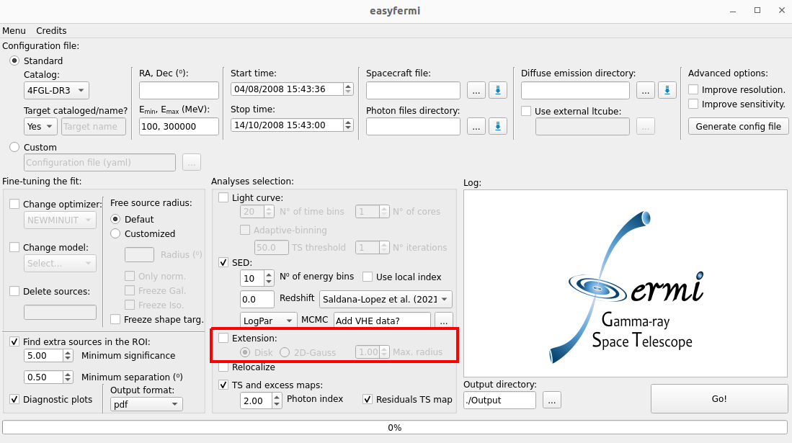
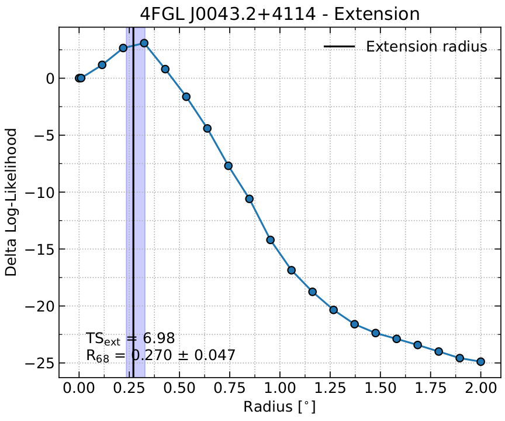

Extension
=========

.. _Extension basics:

Extension - Basics
------------------

If the box "Extension" is checked, ``easyfermi`` will look for extended emission for the gamma-ray target by calling the ``fermipy`` function `extension() <https://fermipy.readthedocs.io/en/latest/advanced/extension.html>`_ with the following configuration:

.. code-block::

    extension(Target_Name,width=scan_list, spatial_model='RadialDisk', sqrt_ts_threshold = 3, update = True)
    
Where the input parameters for this function are:

* **Target_Name**: This is the name of the target as listed in the adopted Fermi-LAT catalog or the target name written in the field "Target name" in the graphical interface.

* **scan_list**: This is a list with 20 elements, where the first element is set to 0.01°, and the last element is defined by the user in the graphical interface spinbox "Max. radius". The default value is 1°. Each element of this list defines a radius for the given spatial model (see **spatial_model** below), such that at the end we will fit 20 disks or 2D-Gaussians and extract the significance profile.

* **spatial_model**: The spatial model is defined by the user in the graphical interface. It accepts only two models: 'RadialDisk' and 'RadialGaussian'.

* **sqrt_ts_threshold**: The threshold on sqrt(TS_ext) that will be applied when update = True. This value is set as 3, meaning that the model will be updated only if the extended emission significance is above 3 sigma. 

* **update**: Set as True. The RoI model will be updated with the extended fit if the significance of the extended source with respect to a poin-like source is above 3 sigma.

This method also generates two data files, namely "TARGET_NAME_ext.fits" and "TARGET_NAME_ext.npy", containing the extendend emission fit results, and a "Quickplot_extension" plot showing the delta log-likelihood profile as a function of the spatial model radius, the 68% containment radius :math:`R_{68}`, and :math:`TS_{ext}`, which tells us how significant is the extended model if compared with a point-like model. These files are saved in the output directory defined in the graphical interface. The figure below shows the "Quickplot_extension" plot for the Andromeda galaxy (M31) observed over ~ 15 years with the Fermi-LAT at energies above 1 GeV, where we can see a hint of extended emission.

lots=True.

.. _Extension_advanced:

Extension - Advanced
--------------------

If you want to use customized spatial models, you should use easyfermi in the "Custom" mode. The box "Extension" will not be useful for you in this case, so leave it unchecked.

If you don't know how to use the "Custom" mode in easyfermi, take a look at this tutorial `here <https://www.youtube.com/watch?v=BG3ldxJv7t4&t=105s&ab_channel=easyFermi>`_.

Ok, now that you know how to use the "Custom" mode, you need to follow only two steps:

* Create the spatial map in the shape you prefer by following `this tutorial <https://fermi.gsfc.nasa.gov/ssc/data/analysis/scitools/extended/extended.html>`_.

* Open the config.yaml file and edit the **model** section as follows:

.. code-block::

    [...]
    model:
      src_roiwidth : 20
      galdiff  : '/home/username/path/to/diffuse/gll_iem_v07.fits'
      isodiff  : '/home/username/path/to/diffuse/iso_P8R3_SOURCE_V3_v1.txt'
      catalogs : ['4FGL-DR3']
      sources  :
        - { name: 'Target_Nickname', ra : 0.0, dec : 0.0,
         SpectrumType : 'PowerLaw', Index : 2.0, Scale : 1000, Prefactor : !!float 1e-11,
         SpatialModel: 'SpatialMap', Spatial_Filename : '/home/path/to/the_template_you_did_in_the_previous_step.fits' }
         
where you have to substitute the variables *name, ra, dec, SpectrumType* and *Spatial_Filename* by the values corresponding to your analysis. Note that the entries *Index, Scale*, and *Prefactor* are not mandatory. The *SpectrumType* options and corresponding parameters are named according to the LAT `spectral model definitions <https://fermi.gsfc.nasa.gov/ssc/data/analysis/scitools/source_models.html>`_.

.. note::

   If your target is already listed as a point-like source in the adopted catalog (default is 4FGL-DR3), you **must** delete this point-like source from the RoI model using the field "Delete sources". Otherwise we will have an extended source superposed with a point-like source. 

 

