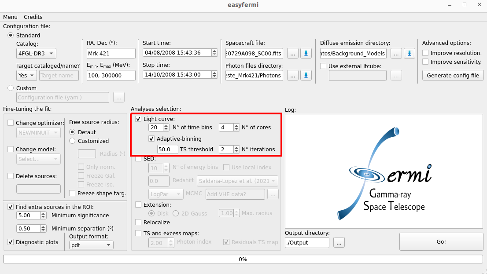
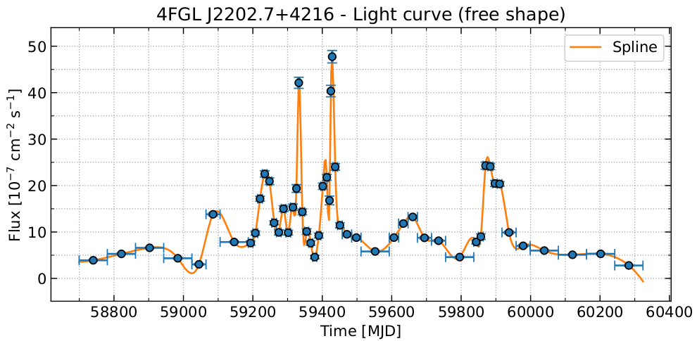

Light curves
============

.. _Constant time bins:

Constant-binning light curve
---------------------------

A constant-binning light curve is generated with the ``fermipy`` function `lightcurve() <https://fermipy.readthedocs.io/en/latest/advanced/lightcurve.html>`_ with the following configuration for Linux/WindowsWSL OS:

.. code-block::

    lightcurve(Target_Name, nbins=N_Bins, free_radius=Radius,
    use_local_ltcube=True, use_scaled_srcmap=True, free_params=['norm','shape'],
    shape_ts_threshold=9, multithread=True, nthread=N_cores)

And the following one for Mac OS: 

.. code-block::

    lightcurve(Target_Name, nbins=N_Bins, free_radius=Radius,
    use_local_ltcube=True, use_scaled_srcmap=True, free_params=['norm','shape'],
    shape_ts_threshold=9)
    
Where the only difference is that for Mac OS we do not parallelize the computation of the light curve. The input parameters for this function are:

* **Target_Name**: This is the name of the target as listed in the adopted Fermi-LAT catalog or the target name written in the field "Target name" in the graphical interface.

* **N_Bins**: The number of time bins set up in the graphical interface as "**N° of time bins**".

* **Radius**: All sources within this radius (centered on the target) are free to vary in the fit. This radius is set as half of the RoI width (see :ref:`basic`) or defined by the user within the box "Radius" within the "Fine-tuning the fit" box.

* **N_cores**: Number of cores read from the graphical interface as "**N° cores**".

.. note::

   **easyfermi** will look for preexisting light curves with the same number of time bins set up in the graphical interface. If, for instance, you already produced a light curve with 20 bins, and you are asking for a new light curve with 20 bins, **easyfermi** will give you a warning in the log, and skip the light curve computation.

Adaptive-binning light curve
----------------------------

This method allows for the computation of a light curve with adaptive time bins, giving us much more information about the variability of the target. It requires a precomputed light curve with constant time bins, as show in the section `Constant time bins`_.

Here we do a loop over every bin of the precomputed light curve and check if the TS of that bin is larger than :math:`2~\times~ TS_{Threshold}`, where :math:`TS_{Threshold}` is read from the graphical interface as "**TS threshold**". For the bins at which this condition is satisfied, we apply the ``fermipy`` function `lightcurve() <https://fermipy.readthedocs.io/en/latest/advanced/lightcurve.html>`_ again with:

.. code-block::

    N_Bins = int(  (TS of the current bin)/(TS_{Threshold})  )

Such that ``N_Bins`` is the lower closest integer to this ratio. For a target with a relatively constant gamma-ray emission, the new bins will all have :math:`TS \sim TS_{Threshold}`.

For each new run of ``lightcurve()`` for a specific bin, we adopt the local data files (i.e. *ft1_00.fits*, *srcmap_00.fits*, *bexpmap_00* etc) produced by ``fermipy``.

The parameter ``N_iter`` is read from the graphical interface as "**N° iterations**" and tells **easyfermi** how many times it should rerun the function ``lightcurve()`` in the latest light curve available. For instance, if ``N_iter = 2`` and there is no precomputed light curve, **easyfermi** will first run the constant-binning light curve (see `Constant time bins`_), then compute an adaptive-binning light curve by increasing the time resolution of the bins with :math:`TS > 2 ~\times~ TS_{Threshold}`, and then compute a third (even finer) adaptive-binning light curve by increasing the resolution of the remaining bins with :math:`TS > 2 ~\times~ TS_{Threshold}`. In summary: the higher is the value of ``N_iter``, the higher is the final resolution of the light curve.

 

This method of computing an adaptive-binning light curve is different from the method described in `Lott et al. 2012 <https://ui.adsabs.harvard.edu/abs/2012A%26A...544A...6L/abstract>`_, and presents some advantages and disadvantages:

**Pros:**

* Analysis can be done in parallel (except for Mac OS).

* Analysis becomes faster and faster at each new iteration, since we select only the bins that satisfy :math:`TS > 2 \times TS_{Threshold}`.

**Cons:**

* We can eventually run into upper limits, especially if we set :math:`TS_{Threshold} < 50`.

.. note::

   We recommend setting :math:`TS_{Threshold} \geq 50`. With smaller threshold values we can achieve higher time resolution, however, we increase the probability of running into upper limits.

In the figures below, we show the constant- and adaptive-binned light curves for BL Lac from 04/08/2019 15:43:36 up to 14/01/2024 15:43:00 and in the energy range 100 MeV up to 300000 MeV, during some major flaring activity. Since in this especific case we have extraordinary statistics, we set :math:`TS_{Threshold} = 5000` and 2 iterations for the adaptive-binned light curve. We see that both light curves present the same overall behavior, although in the adaptive-binned case we can recover much more information (in this specific case, the statistics is so high that we barely can see the error bars).

.. image:: ./BLLac_cte.png
  :width: 700
  

