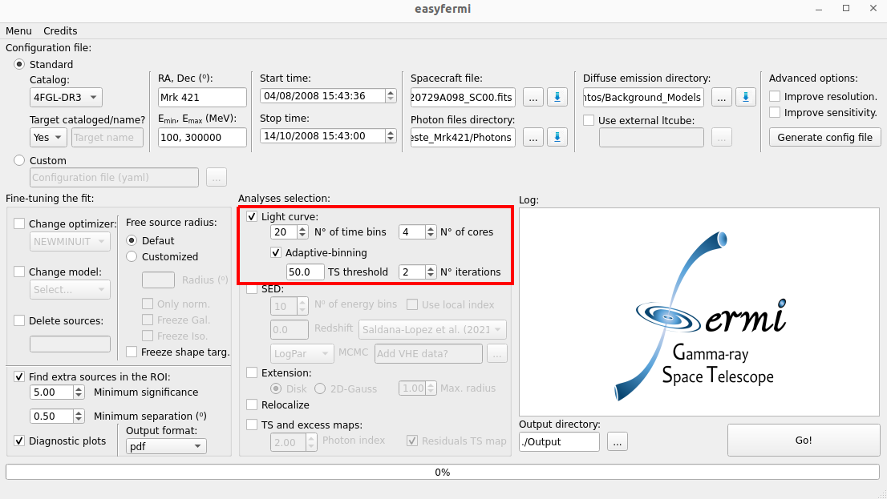
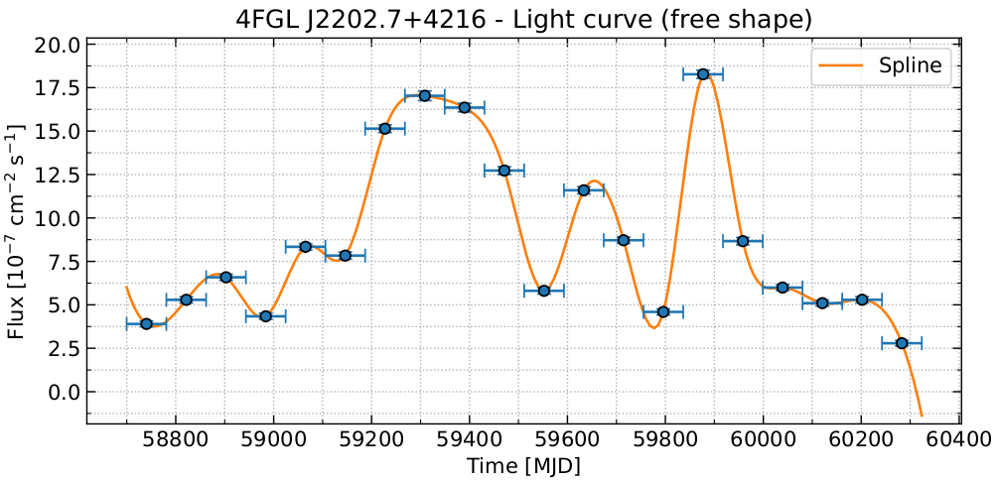
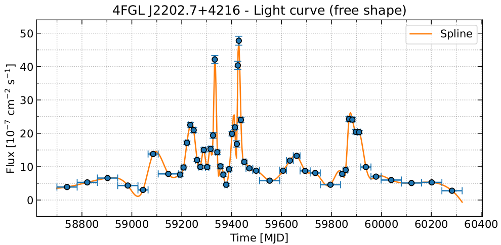
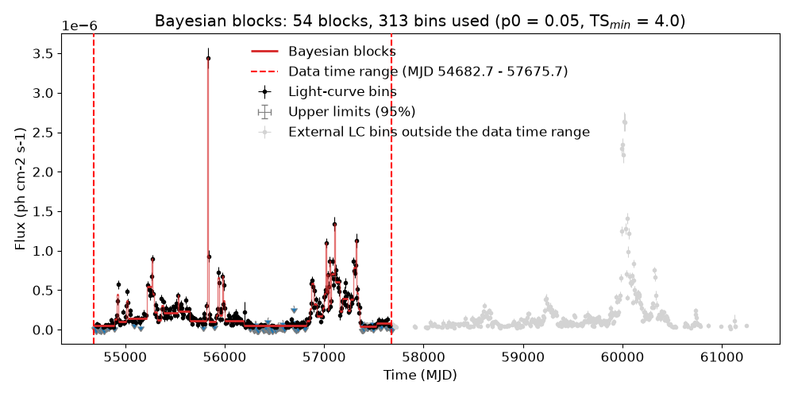

Light curves
============

.. _Constant time bins:

Constant-binning light curve
----------------------------

A constant-binning light curve is generated with the ``fermipy`` function `lightcurve() <https://fermipy.readthedocs.io/en/latest/advanced/lightcurve.html>`_ with the following configuration for Linux/WindowsWSL OS:

.. code-block::

    lightcurve(Target_Name, nbins=N_Bins, free_radius=Radius,
    use_local_ltcube=True, use_scaled_srcmap=True, free_params=['norm','shape'],
    shape_ts_threshold=9, multithread=True, nthread=N_cores)

And the following one for Mac OS: 

.. code-block::

    lightcurve(Target_Name, nbins=N_Bins, free_radius=Radius,
    use_local_ltcube=True, use_scaled_srcmap=True, free_params=['norm','shape'],
    shape_ts_threshold=9)
    
Where the only difference is that for Mac OS we do not parallelize the computation of the light curve. The input parameters for this function are:

* **Target_Name**: This is the name of the target as listed in the adopted Fermi-LAT catalog or the target name written in the field "Target name" in the graphical interface.

* **N_Bins**: The number of time bins set up in the graphical interface as "**N° of time bins**".

* **Radius**: All sources within this radius (centered on the target) are free to vary in the fit. This radius is set as half of the RoI width (see :ref:`basic`) or defined by the user within the box "Radius" within the "Fine-tuning the fit" box.

* **N_cores**: Number of cores read from the graphical interface as "**N° cores**".

.. note::

   **easyfermi** will look for preexisting light curves with the same number of time bins set up in the graphical interface. If, for instance, you already produced a light curve with 20 bins, and you are asking for a new light curve with 20 bins, **easyfermi** will give you a warning in the log, and skip the light curve computation.

Adaptive-binning light curve
----------------------------

This method allows for the computation of a light curve with adaptive time bins, giving us much more information about the variability of the target. It requires a precomputed light curve with constant time bins, as show in the section `Constant time bins`_.

Here we do a loop over every bin of the precomputed light curve and check if the TS of that bin is larger than :math:`2~\times~ TS_{Threshold}`, where :math:`TS_{Threshold}` is read from the graphical interface as "**TS threshold**". For the bins at which this condition is satisfied, we apply the ``fermipy`` function `lightcurve() <https://fermipy.readthedocs.io/en/latest/advanced/lightcurve.html>`_ again with:

.. code-block::

    N_Bins = int(  (TS of the current bin)/(TS_{Threshold})  )

Such that ``N_Bins`` is the lower closest integer to this ratio. For a target with a relatively constant gamma-ray emission, the new bins will all have :math:`TS \sim TS_{Threshold}`.

For each new run of ``lightcurve()`` for a specific bin, we adopt the local data files (i.e. *ft1_00.fits*, *srcmap_00.fits*, *bexpmap_00* etc) produced by ``fermipy``.

The parameter ``N_iter`` is read from the graphical interface as "**N° iterations**" and tells **easyfermi** how many times it should rerun the function ``lightcurve()`` in the latest light curve available. For instance, if ``N_iter = 2`` and there is no precomputed light curve, **easyfermi** will first run the constant-binning light curve (see `Constant time bins`_), then compute an adaptive-binning light curve by increasing the time resolution of the bins with :math:`TS > 2 ~\times~ TS_{Threshold}`, and then compute a third (even finer) adaptive-binning light curve by increasing the resolution of the remaining bins with :math:`TS > 2 ~\times~ TS_{Threshold}`. In summary: the higher is the value of ``N_iter``, the higher is the final resolution of the light curve.

 

This method of computing an adaptive-binning light curve is different from the method described in `Lott et al. 2012 <https://ui.adsabs.harvard.edu/abs/2012A%26A...544A...6L/abstract>`_, and presents some advantages and disadvantages:

**Pros:**

* Analysis can be done in parallel (except for Mac OS).

* Analysis becomes faster and faster at each new iteration, since we select only the bins that satisfy :math:`TS > 2 \times TS_{Threshold}`.

**Cons:**

* We can eventually run into upper limits, especially if we set :math:`TS_{Threshold} < 50`.

.. note::

   We recommend setting :math:`TS_{Threshold} \geq 50`. With smaller threshold values we can achieve higher time resolution, however, we increase the probability of running into upper limits.

In the figures below, we show the constant- and adaptive-binned light curves for BL Lac from 04/08/2019 15:43:36 up to 14/01/2024 15:43:00 and in the energy range 100 MeV up to 300000 MeV, during some major flaring activity. Since in this especific case we have extraordinary statistics, we set :math:`TS_{Threshold} = 5000` and 2 iterations for the adaptive-binned light curve. We see that both light curves present the same overall behavior, although in the adaptive-binned case we can recover much more information (in this specific case, the statistics is so high that we barely can see the error bars).

  

.. _Bayesian blocks:

Bayesian-blocks light curve
---------------------------

This method computes a light curve whose time bins are defined by the Bayesian blocks (`Scargle et al. 2013 <https://ui.adsabs.harvard.edu/abs/2013ApJ...764..167S/abstract>`_) of a previously available light curve. Periods in which the flux is statistically consistent with a constant value are merged into a single time bin, while significant flux changes define the edges between bins. 

It is activated by the box **Bayesian blocks LC**. The input light curve is selected in the drop-down menu next to this box:

* **Local LC**: the light curve computed by **easyfermi** in the same analysis. If an adaptive-binning light curve exists in the output directory (see section `Adaptive-binning light curve`_), it is used; otherwise, the latest constant-binning light curve is adopted (see section `Constant time bins`_).

* **External LC**: a light curve selected by the user with the browse button. It can be a **.fits** table from a previous **easyfermi**/``fermipy`` analysis or a **.csv** file downloaded from the `Fermi-LAT Light Curve Repository (LCR) <https://fermi.gsfc.nasa.gov/ssc/data/access/lat/LightCurveRepository/>`_. 

.. note::

   The **.csv** files from the LCR only provide the photon flux and do not give the width of the time bins. In this case, **easyfermi** adopts the median time separation between consecutive bins as the width of all bins.

The Bayesian blocks are computed as follows:

1. For the **External LC** option: only the part of the input light curve that overlaps the time range of the analysis is used. A bin that is only partially inside this range is kept, and the bins entirely outside it are ignored. If an external light curve is shorter than the time range of the analysis, the Bayesian-blocks light curve covers only the period of the external light curve.

2. The blocks are computed with the function `bayesian_blocks <https://docs.astropy.org/en/stable/api/astropy.stats.bayesian_blocks.html>`_ from ``astropy``, using the fitness function for point measurements, i.e. the flux and flux error of each time bin. Only the bins with :math:`TS \geq 4` (the convention adopted in the LCR to define upper limits) enter the calculation. The bins with upper limits are ignored.

3. The false-alarm probability of the algorithm is set by the box :math:`\rho_0`. It corresponds to the parameter :math:`p_0` of Scargle et al. (2013), i.e. the probability of finding a change in the flux when the flux is actually constant. The lower the value of :math:`\rho_0`, the more significant a flux change needs to be to define a new block, and thus the smaller the number of blocks. The default value is 0.05.

4. The edge between two consecutive blocks is placed in the middle of the gap between the last bin of the first block and the first bin of the second block. Bins with upper limits that fall inside this gap are therefore split equally between the two neighboring blocks. The first and last edges are the limits of the input light curve.

Then, we apply the ``fermipy`` function `lightcurve() <https://fermipy.readthedocs.io/en/latest/advanced/lightcurve.html>`_ with the time bins given by the Bayesian blocks, using the following configuration for Linux/WindowsWSL OS:

.. code-block::

    lightcurve(Target_Name, time_bins=Edges, free_radius=Radius,
    use_local_ltcube=True, use_scaled_srcmap=True, free_params=['norm','shape'],
    shape_ts_threshold=9, multithread=True)

And the following one for Mac OS, where the computation is not parallelized:

.. code-block::

    lightcurve(Target_Name, time_bins=Edges, free_radius=Radius,
    use_local_ltcube=True, use_scaled_srcmap=True, free_params=['norm','shape'],
    shape_ts_threshold=9, multithread=False)

Where ``Edges`` are the edges of the time bins (in MET) defined by the Bayesian blocks and ``Radius`` is half of the RoI width (see :ref:`basic`).

The results are saved in the directory **Bayesian_blocks_light_curve_p0=XXX**, where **XXX** is the value of :math:`\rho_0` set in the graphical interface. This directory contains the analysis of each time bin (one **lightcurve_XXX** directory per bin) and the file **bayesian_blocks_lightcurve.fits** with the light-curve data. Light curves computed with different values of :math:`\rho_0` are saved in different directories, but if a directory with the same value of :math:`\rho_0` already exists, its content is replaced.

Quick plots
~~~~~~~~~~~

When the option **External LC** is selected, the button **Quick plot** shows the Bayesian blocks of the external light curve without running the analysis, which is useful to choose the value of :math:`\rho_0`. The plot is computed with the time range and the value of :math:`\rho_0` currently set in the graphical interface and is shown in a new window. The black points are the bins used in the calculation, the gray arrows are the upper limits, and the red lines are the Bayesian blocks. The light gray points are the bins outside the time range of the analysis, which is marked by the red dashed vertical lines. The title of the figure gives the number of blocks, the number of bins used and the values of :math:`\rho_0` and :math:`TS_{min}` adopted, as shown in the figure below:

After the analysis, **easyfermi** also saves the figures **Quickplot_Bayesian_blocks_p=XXX_LC_N_bins** (photon flux) and **Quickplot_Bayesian_blocks_p=XXX_eLC_N_bins** (energy flux) in the output directory, where **XXX** is the value of :math:`\rho_0` and **N** is the number of Bayesian blocks. They show the Bayesian-blocks light curve on top of the original light curve in gray (the adaptive-binning light curve, if available, or the constant-binning one).

SEDs for the light-curve bins
-----------------------------

If the box **Compute SEDs for LC bins** is checked, **easyfermi** also computes the SED of every time bin of the latest light curve available and fits a spectral model to each one of them with the MCMC. The light curve is chosen with the following priority: 1) the latest modified Bayesian-blocks light curve, 2) the latest modified adaptive-binning light curve, and 3) the latest modified constant-binning light curve. For more details, see section :ref:`SED per LC bin`.

