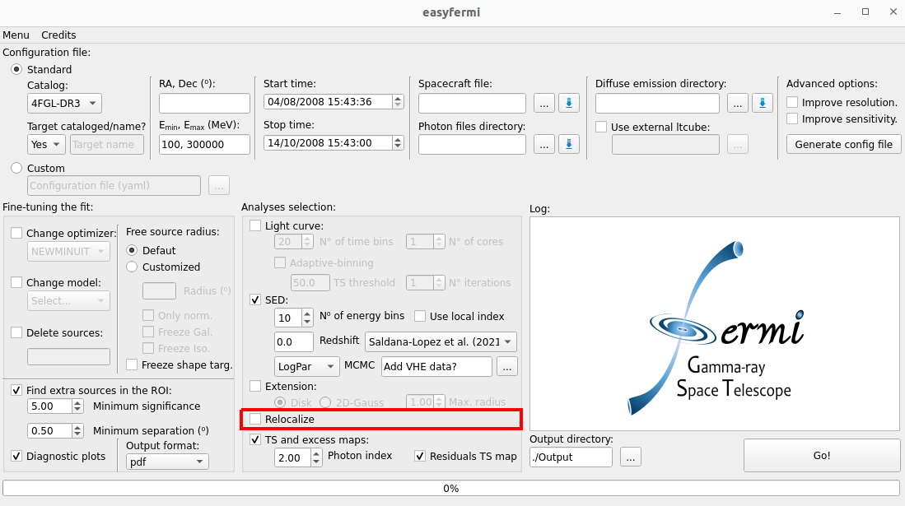

Relocalization
==============

.. _Relocalization:

Relocalization
--------------

If the box "Relocalize" is checked, ``easyfermi`` will find the best-fit R.A. and Dec. for the gamma-ray target by calling the ``fermipy`` function `localize() <https://fermipy.readthedocs.io/en/latest/advanced/localization.html>`_ with the following configuration:

.. code-block::

    localize(Target_Name, make_plots=True, update=True)

The input parameters for this function are:

* **Target_Name**: This is the name of the target as listed in the adopted Fermi-LAT catalog or the target name written in the field "Target name" in the graphical interface.

* **make_plots**: This is always True in easyfermi, meaning that the diagnostic plots will always be saved in the output directory.

* **update**: This is always True in easyfermi, meaning that the RoI model will be updated with the new best-fit coordinates for the target (only if the fit succeeds).

This method also generates two data files, namely "TARGET_NAME_loc.fits" and "TARGET_NAME_loc.npy", containing the old and new coordinates of the gamma-ray target, as well as the r68, r95, and r99 uncertainty radii. These files are saved in the output directory defined in the graphical interface.

 

